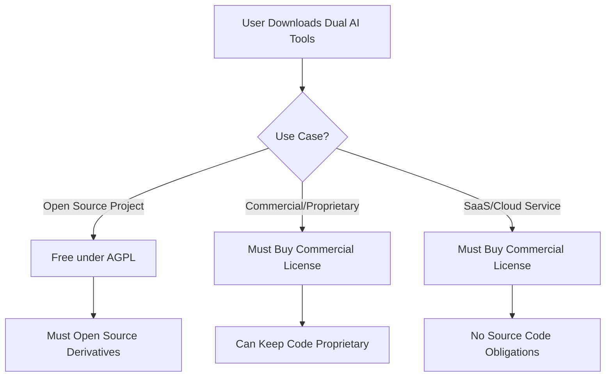

# Licensing Strategy for Dual AI Tools

## 🎯 Recommended Approach: Dual Licensing with AGPL + Commercial

### Why This Strategy Works

1. **Open Source Community** ✅
   - Builds trust and adoption
   - Gets community contributions
   - Creates brand awareness
   - Allows free use for open-source projects

2. **B2B Commercialization** 💰
   - Enterprises must buy commercial license
   - No GPL obligations for their code
   - You retain full control
   - Can offer SLA, support, customization

## 📊 License Comparison for Your Use Case

| License | Open Source | B2B Revenue | Protect IP | Enterprise Friendly | Examples |
|---------|------------|-------------|------------|-------------------|----------|
| **AGPL-3.0 + Commercial** ⭐ | ✅ | ✅✅✅ | ✅✅✅ | ✅ (with paid license) | MongoDB, GitLab, Nextcloud |
| MIT/Apache 2.0 | ✅✅✅ | ❌ | ❌ | ✅✅✅ | React, Kubernetes |
| GPL-3.0 + Commercial | ✅ | ✅✅ | ✅✅ | ✅ (with paid license) | Qt, MySQL |
| BSL (Business Source) | ⚠️ | ✅✅✅ | ✅✅✅ | ✅ | MariaDB, Cockroach |
| Elastic License 2.0 | ⚠️ | ✅✅ | ✅✅ | ✅ | Elasticsearch |

## 🚀 Recommended: AGPL-3.0 + Commercial Dual License

### How It Works



### Why AGPL Instead of GPL?

- **AGPL closes the "SaaS loophole"** - Even cloud services must open-source or buy license
- **Maximum leverage for commercialization** - More companies need commercial license
- **Strong copyleft** - Protects your IP better

## 💰 B2B Commercialization Model

### Tier 1: Community Edition (AGPL)
- **Price**: Free
- **For**: Open source projects, personal use
- **Support**: Community only
- **Updates**: When available
- **Requirement**: Must open-source derivatives

### Tier 2: Startup License
- **Price**: $299/month
- **For**: Companies <$1M ARR
- **Support**: Email (48hr response)
- **Updates**: Monthly
- **Features**: Commercial use, keep code private

### Tier 3: Enterprise License
- **Price**: $2,999/month
- **For**: Large companies
- **Support**: Priority (4hr response)
- **Updates**: Immediate
- **Features**: 
  - On-premise deployment
  - Custom AI model selection
  - SLA guarantees
  - Training included

### Tier 4: OEM/Reseller License
- **Price**: Custom (typically $10k-50k/year)
- **For**: Companies embedding in their products
- **Support**: Dedicated account manager
- **Features**: White-labeling, redistribution rights

## 📝 Implementation Steps

### 1. License Files Structure
```
dual-ai-tools/
├── LICENSE                 # Overview pointing to both licenses
├── LICENSE-AGPL.txt        # Full AGPL-3.0 text
├── LICENSE-COMMERCIAL.txt  # Commercial license template
├── LICENSING.md           # Explanation for users
└── CONTRIBUTING.md        # CLA requirement
```

### 2. Code Headers
```typescript
/**
 * Dual AI Tools - Confidence-Based Problem Solver
 * Copyright (c) 2024 [Your Name]
 * 
 * This file is part of Dual AI Tools.
 * 
 * Dual AI Tools is free software: you can redistribute it and/or modify
 * it under the terms of the GNU Affero General Public License as published by
 * the Free Software Foundation, either version 3 of the License, or
 * (at your option) any later version.
 * 
 * Dual AI Tools is distributed in the hope that it will be useful,
 * but WITHOUT ANY WARRANTY; without even the implied warranty of
 * MERCHANTABILITY or FITNESS FOR A PARTICULAR PURPOSE. See the
 * GNU Affero General Public License for more details.
 * 
 * For commercial licensing, visit: https://your-domain.com/pricing
 */
```

### 3. Package.json License Field
```json
{
  "license": "AGPL-3.0-or-later OR Commercial",
  "licenses": [
    {
      "type": "AGPL-3.0-or-later",
      "url": "https://www.gnu.org/licenses/agpl-3.0.html"
    },
    {
      "type": "Commercial",
      "url": "https://your-domain.com/commercial-license"
    }
  ]
}
```

## 🛡️ Protecting Your IP

### 1. Trademark Your Brand
- Register "Dual AI Tools" as trademark
- Prevents others from using your name
- Costs ~$250-750 per class

### 2. Require CLA for Contributors
- Contributors assign copyright to you
- Allows you to maintain dual licensing
- Use CLA Assistant on GitHub

### 3. Keep Some Features Proprietary
```
dual-ai-tools/
├── core/              # AGPL licensed
├── enterprise/        # Commercial only
│   ├── sso/          # Single Sign-On
│   ├── audit/        # Audit logging
│   └── analytics/    # Usage analytics
```

## 📈 Revenue Projections

### Conservative Estimate (Year 1)
- 10,000 open source users (free)
- 50 startup licenses × $299/mo = **$14,950/month**
- 10 enterprise licenses × $2,999/mo = **$29,990/month**
- **Total: ~$540,000/year**

### Growth Scenario (Year 2)
- 50,000 open source users (brand awareness)
- 200 startup licenses = **$59,800/month**
- 30 enterprise licenses = **$89,970/month**
- 5 OEM licenses × $30k/year = **$12,500/month**
- **Total: ~$1.95M/year**

## 🎯 Go-to-Market Strategy

### Phase 1: Build Community (Months 1-3)
1. Launch on GitHub with AGPL
2. Post on HackerNews, Reddit r/programming
3. Create YouTube demos
4. Write blog posts about the dual-AI approach

### Phase 2: Early Monetization (Months 4-6)
1. Add "Enterprise" features
2. Implement license key system
3. Set up Stripe billing
4. Reach out to early adopters

### Phase 3: Scale (Months 7-12)
1. Partner with dev tool companies
2. Sponsor conferences/podcasts
3. Build integration marketplace
4. Hire first support engineer

## ⚖️ Legal Considerations

### Must Do:
1. **Register LLC/Corporation** - Protects personal assets
2. **Get Terms of Service** - For commercial customers
3. **Privacy Policy** - GDPR/CCPA compliance
4. **Export Compliance** - If using strong encryption

### Nice to Have:
1. **Patent Application** - For the dual-AI validation method
2. **Trademark Registration** - For brand protection
3. **Insurance** - E&O and Cyber liability

## 🔄 Alternative Licensing Models

### If AGPL Seems Too Strong:

1. **Elastic License 2.0**
   - Prevents competitors from offering as service
   - More enterprise-friendly than AGPL
   - Still allows commercialization

2. **Business Source License (BSL)**
   - Becomes open source after time delay
   - Full commercial control initially
   - Used by MariaDB

3. **Commons Clause + Apache 2.0**
   - Prevents commercial use without license
   - Simpler than dual licensing
   - Less tested legally

## 💡 Key Success Factors

1. **Clear Value Proposition**
   - Community: Free powerful tool
   - Enterprise: No legal risk + support

2. **Easy License Conversion**
   ```bash
   npx dual-ai-tools activate-license YOUR_KEY
   ```

3. **Visible Enterprise Features**
   - SSO integration
   - Audit logs
   - Priority AI model access
   - Custom model training

4. **Strong Documentation**
   - Clear licensing FAQ
   - Enterprise onboarding guide
   - ROI calculator for businesses

---

## 📞 Next Steps

1. Choose final license model (recommend AGPL + Commercial)
2. Set up GitHub repository with proper licensing
3. Create pricing page on website
4. Implement license key validation
5. Launch to community!

Remember: You can always relax licensing later, but you can't make it stricter without controversy.